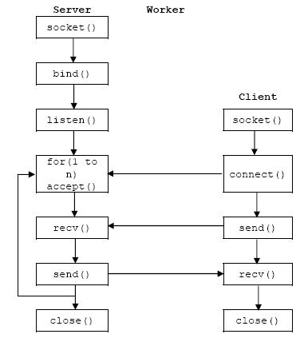

# Socket

---

## Socket 流程图

## Socket 编程思路

* **Server**
	* **创建 Socket，并与主机绑定**
		* **``sock = socket.socket(socket.AF_INET,socket.SOCK_STREAM)``**
		* **``sock.bind((host,port))``**
	* **监听连接**
		* **``sock.listen(backlog)``**
	* **进入循环，不断接受客户端的连接请求**
		* **conn, addr = sock.accept()**
	* **接收数据 \ 发送数据**
		* **``data = str(sock.recv(size), encoding="utf-8")``**
		* **``sock.send(bytes(data, encoding="utf8"))``**
	* **传输完毕后，关闭套接字**
		* **``socket.close()``**
* **Client**
	* **创建 Socket，连接远端地址**
		* **``sock = socket.socket(socket.AF_INET,socket.SOCK_STREAM)``**
		* **``sock.connect((ip,port))``**
	* **接收数据 \ 发送数据**
		* **``data = str(sock.recv(size), encoding="utf-8")``**
		* **``sock.send(bytes(data, encoding="utf8"))``**
	* **传输完毕后，关闭套接字**
		* **``socket.close()``**
